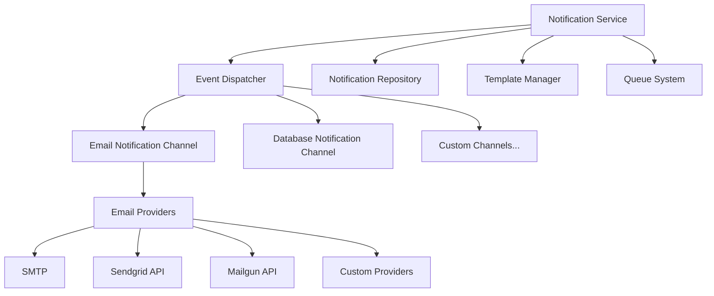

# Glueful Notification System

This comprehensive guide covers Glueful's notification system, including multi-channel delivery, email notifications, template management, and advanced features for enterprise-grade notification management.

## Table of Contents

1. [Overview](#overview)
2. [Architecture](#architecture)
3. [Core Components](#core-components)
4. [Email Notification Channel](#email-notification-channel)
5. [Multi-Channel Support](#multi-channel-support)
6. [API Endpoints](#api-endpoints)
7. [Configuration](#configuration)
8. [Usage Examples](#usage-examples)
9. [Template System](#template-system)
10. [Advanced Features](#advanced-features)
11. [Error Handling](#error-handling)
12. [Best Practices](#best-practices)

## Overview

The Glueful Notification System, introduced in v0.19.0, provides a comprehensive solution for managing user notifications across multiple channels. The system is designed for enterprise-grade applications requiring reliable, scalable, and flexible notification delivery.

### Key Features

- **Multi-Channel Delivery**: In-app, email, and extensible channel architecture
- **Template-Based Notifications**: Reusable templates with variable substitution
- **Email Integration**: Full-featured email notification system with multiple providers
- **Delivery Tracking**: Read/unread status, delivery confirmation, and retry mechanisms
- **Queue Integration**: Asynchronous notification processing with queue support
- **Event-Driven Architecture**: Comprehensive event system for notification lifecycle
- **Advanced Configuration**: Flexible configuration for different environments
- **Performance Optimization**: Caching, batching, and efficient database operations

## Architecture

The notification system follows a modular, event-driven architecture:



### Core Components

1. **NotificationService**: Central service for notification management
2. **NotificationRepository**: Data access layer for notifications
3. **Event Dispatcher**: Handles notification events and channel routing
4. **Template Manager**: Manages notification templates and rendering
5. **Channel System**: Pluggable delivery channels (email, database, etc.)
6. **Queue Integration**: Asynchronous processing and retry mechanisms

## Core Components

### Notification Service

The `NotificationService` is the primary interface for notification management:

```php
use Glueful\Notifications\NotificationService;

$notificationService = container()->get(NotificationService::class);

// Send notification
$result = $notificationService->send(
    'user_welcome',                    // type
    $notifiableUser,                   // recipient (implements Notifiable)
    'Welcome to our platform!',       // subject
    ['username' => $user->name],       // data
    ['channels' => ['email', 'database']] // options
);

// Template-based notifications
$result = $notificationService->sendWithTemplate(
    'password_reset',
    $notifiableUser,
    'password-reset-template',
    ['reset_url' => $resetUrl],
    ['channels' => ['email']]
);

// Scheduled notifications
$notificationService->create(
    'subscription_reminder',
    $user,
    'Your subscription expires soon',
    ['expiry_date' => $expiryDate],
    ['channels' => ['email'], 'schedule' => new DateTime('+7 days')]
);
```

### Notification Repository

Database operations and querying:

```php
use Glueful\Notifications\NotificationRepository;

$repository = container()->get(NotificationRepository::class);

// Get user notifications
$notifications = $repository->findByUser($userUuid);
$unread = $repository->getUnreadCount($userUuid);

// Query with filters
$recent = $repository->findByUser($userUuid, [
    'limit' => 10,
    'type' => 'order_update',
    'read' => false
]);

// Mark notifications as read
$repository->markAsRead($notificationUuid);
$repository->markAllAsRead($userUuid);
```

### Event System

The notification system dispatches events throughout the notification lifecycle:

```php
// Available Events
use Glueful\Notifications\Events\NotificationCreatedEvent;
use Glueful\Notifications\Events\NotificationSentEvent;
use Glueful\Notifications\Events\NotificationFailedEvent;
use Glueful\Notifications\Events\NotificationReadEvent;

// Event Listeners
class NotificationEventListener
{
    public function onNotificationCreated(NotificationCreatedEvent $event): void
    {
        $notification = $event->getNotification();
        // Log notification creation
    }

    public function onNotificationFailed(NotificationFailedEvent $event): void
    {
        $notification = $event->getNotification();
        $error = $event->getError();
        // Handle delivery failure, schedule retry
    }
}
```

## Email Notification Channel

The email notification channel provides comprehensive email delivery capabilities.

### Email Providers

Multiple email providers are supported:

#### SMTP Configuration

```php
// config/mail.php
return [
    'providers' => [
        'smtp' => [
            'host' => 'smtp.example.com',
            'port' => 587,
            'encryption' => 'tls',
            'username' => 'your-username',
            'password' => 'your-password',
            'timeout' => 30,
        ],
    ],
    'default' => 'smtp',
];
```

#### Sendgrid API

```php
'sendgrid' => [
    'api_key' => 'your-sendgrid-api-key',
    'endpoint' => 'https://api.sendgrid.com/v3/mail/send',
    'from' => [
        'address' => 'noreply@example.com',
        'name' => 'Your App'
    ],
],
```

#### Mailgun API

```php
'mailgun' => [
    'api_key' => 'your-mailgun-api-key',
    'domain' => 'mail.yourdomain.com',
    'endpoint' => 'https://api.mailgun.net/v3/',
],
```

### Email Features

#### Basic Email Sending

```php
// Simple email notification
$emailNotification = Extensions::get('email_notification');

$emailNotification->send([
    'to' => 'recipient@example.com',
    'subject' => 'Welcome to Our Platform',
    'template' => 'welcome',
    'variables' => [
        'user_name' => 'John Doe',
        'verification_link' => 'https://example.com/verify/token123'
    ]
]);
```

#### Advanced Email Options

```php
// Email with attachments and advanced options
$emailNotification->send([
    'to' => [
        ['email' => 'recipient1@example.com', 'name' => 'Recipient One'],
        ['email' => 'recipient2@example.com', 'name' => 'Recipient Two']
    ],
    'cc' => ['cc@example.com'],
    'bcc' => ['bcc@example.com'],
    'subject' => 'Your Invoice #123',
    'template' => 'invoice',
    'variables' => [
        'invoice_number' => '123',
        'amount' => '$99.99',
        'due_date' => '2025-05-15'
    ],
    'attachments' => [
        [
            'path' => '/path/to/invoice.pdf',
            'name' => 'Invoice-123.pdf',
            'mime' => 'application/pdf'
        ]
    ],
    'provider' => 'sendgrid', // Override default provider
    'priority' => 'high',
    'track_opens' => true,
    'track_clicks' => true
]);
```

#### Batch Email Processing

```php
// Send multiple emails efficiently
$emails = [
    [
        'to' => 'user1@example.com',
        'template' => 'welcome',
        'variables' => ['name' => 'User 1']
    ],
    [
        'to' => 'user2@example.com',
        'template' => 'welcome',
        'variables' => ['name' => 'User 2']
    ]
];

$emailNotification->sendBatch($emails);
```

## Multi-Channel Support

### Channel Priority and Selection

The notification system supports intelligent channel selection:

```php
// Channel selection priority:
// 1. Explicit channels in options
// 2. User preferences
// 3. Default configuration

$notificationService->send(
    'order_shipped',
    $user,
    'Your order has shipped',
    ['tracking_number' => 'ABC123'],
    [
        'channels' => ['email', 'database'], // Explicit channels
        'fallback' => ['database'],          // Fallback if primary fails
        'priority' => 'high'                 // High priority notifications
    ]
);
```

### Channel Configuration

```php
// config/notifications.php
return [
    'channels' => [
        'email' => [
            'enabled' => true,
            'driver' => 'smtp',
            'queue' => 'email-notifications',
            'retry_attempts' => 3,
            'retry_delay' => 300, // seconds
        ],
        'database' => [
            'enabled' => true,
            'table' => 'notifications',
        ],
        'slack' => [
            'enabled' => false,
            'webhook_url' => 'https://hooks.slack.com/...',
        ],
    ],
    'default_channels' => ['database'],
    'user_preferences' => [
        'enabled' => true,
        'table' => 'user_notification_preferences',
    ],
];
```

### Custom Channels

Create custom notification channels:

```php
use Glueful\Notifications\Channels\AbstractChannel;

class SlackChannel extends AbstractChannel
{
    public function send(Notification $notification, array $options = []): bool
    {
        $webhookUrl = config('notifications.channels.slack.webhook_url');
        
        $payload = [
            'text' => $notification->getSubject(),
            'attachments' => [
                [
                    'color' => 'good',
                    'fields' => [
                        [
                            'title' => 'Message',
                            'value' => $notification->getContent(),
                            'short' => false
                        ]
                    ]
                ]
            ]
        ];

        // Send to Slack API
        $response = $this->httpClient->post($webhookUrl, [
            'json' => $payload
        ]);

        return $response->getStatusCode() === 200;
    }

    public function supports(string $type): bool
    {
        return in_array($type, ['alert', 'urgent', 'system']);
    }
}
```

## API Endpoints

### REST API

| Method | Endpoint                                 | Description                                  |
|--------|------------------------------------------|----------------------------------------------|
| GET    | /api/notifications                       | Get all notifications for authenticated user |
| GET    | /api/notifications/unread                | Get unread notifications                     |
| GET    | /api/notifications/{uuid}                | Get a specific notification                  |
| POST   | /api/notifications/mark-read/{uuid}      | Mark a notification as read                  |
| POST   | /api/notifications/mark-all-read         | Mark all notifications as read               |
| DELETE | /api/notifications/{uuid}                | Delete a notification                        |
| GET    | /api/notifications/preferences           | Get user notification preferences            |
| PUT    | /api/notifications/preferences           | Update user notification preferences         |

### API Usage Examples

```php
// Get notifications with pagination
GET /api/notifications?page=1&limit=10&type=order_update

// Response
{
    "success": true,
    "data": {
        "notifications": [...],
        "pagination": {
            "current_page": 1,
            "per_page": 10,
            "total": 45,
            "total_pages": 5
        },
        "unread_count": 12
    }
}

// Mark notification as read
POST /api/notifications/mark-read/uuid-123
{
    "success": true,
    "message": "Notification marked as read"
}

// Update preferences
PUT /api/notifications/preferences
{
    "email_notifications": true,
    "types": {
        "order_updates": ["email", "database"],
        "promotions": ["database"],
        "security_alerts": ["email"]
    }
}
```

## Configuration

### Main Configuration

```php
// config/notifications.php
return [
    'channels' => [
        'email' => [
            'enabled' => true,
            'driver' => 'smtp',
            'from' => [
                'address' => 'noreply@example.com',
                'name' => 'Notification System'
            ],
            'template_path' => 'storage/templates/email',
            'queue' => 'email-notifications',
            'retry_attempts' => 3,
            'retry_delay' => 300,
        ],
        'database' => [
            'enabled' => true,
            'table' => 'notifications',
            'cleanup_after' => 90, // days
        ],
    ],
    'default_channels' => ['database'],
    'templates' => [
        'cache_enabled' => true,
        'cache_ttl' => 3600,
        'fallback_language' => 'en',
    ],
    'queue' => [
        'enabled' => true,
        'connection' => 'redis',
        'queue' => 'notifications',
        'batch_size' => 50,
    ],
    'retry' => [
        'max_attempts' => 3,
        'delay' => 300, // seconds
        'exponential_backoff' => true,
    ],
    'user_preferences' => [
        'enabled' => true,
        'defaults' => [
            'email_notifications' => true,
            'database_notifications' => true,
        ],
    ],
];
```

### Email Extension Configuration

```php
// Extension configuration in extensions.php
'extensions' => [
    'email_notification' => [
        'enabled' => true,
        'config' => [
            'default_provider' => 'smtp',
            'template_path' => 'storage/templates/email',
            'cache' => [
                'enabled' => true,
                'driver' => 'redis',
                'ttl' => 3600
            ],
            'tracking' => [
                'opens' => true,
                'clicks' => true,
                'bounces' => true,
            ],
        ]
    ]
]
```

## Usage Examples

### Basic Notification Sending

```php
use Glueful\Notifications\NotificationService;

class OrderController
{
    private NotificationService $notificationService;

    public function shipOrder(string $orderId): Response
    {
        $order = $this->orderService->ship($orderId);
        
        // Send shipping notification
        $this->notificationService->send(
            'order_shipped',
            $order->getUser(),
            'Your order has shipped!',
            [
                'order_id' => $order->getId(),
                'tracking_number' => $order->getTrackingNumber(),
                'estimated_delivery' => $order->getEstimatedDelivery()
            ],
            ['channels' => ['email', 'database']]
        );

        return $this->json(['success' => true]);
    }
}
```

### Scheduled Notifications

```php
// Schedule reminder notifications
$reminderDate = (new DateTime())->add(new DateInterval('P7D'));

$notificationService->create(
    'subscription_expiry_reminder',
    $user,
    'Your subscription expires soon',
    [
        'expiry_date' => $user->getSubscriptionExpiry()->format('Y-m-d'),
        'renewal_url' => $this->urlGenerator->generate('subscription_renew')
    ],
    [
        'channels' => ['email'],
        'schedule' => $reminderDate,
        'priority' => 'normal'
    ]
);
```

### Bulk Notifications

```php
// Send notifications to multiple users
$users = $this->userRepository->findActiveUsers();
$notifications = [];

foreach ($users as $user) {
    $notifications[] = [
        'type' => 'feature_announcement',
        'recipient' => $user,
        'subject' => 'New Feature Available!',
        'data' => [
            'feature_name' => 'Advanced Analytics',
            'learn_more_url' => '/features/analytics'
        ],
        'options' => ['channels' => ['email', 'database']]
    ];
}

$notificationService->sendBatch($notifications);
```

## Template System

### Email Templates

Templates support HTML and plain text versions with variable substitution:

#### HTML Template (`welcome.html`)

```html
<!DOCTYPE html>
<html>
<head>
    <title>Welcome to {{app_name}}</title>
    <style>
        .container { max-width: 600px; margin: 0 auto; }
        .header { background: #007bff; color: white; padding: 20px; }
        .content { padding: 20px; }
        .button { 
            display: inline-block; 
            background: #28a745; 
            color: white; 
            padding: 10px 20px; 
            text-decoration: none; 
            border-radius: 5px; 
        }
    </style>
</head>
<body>
    <div class="container">
        <div class="header">
            <h1>Welcome, {{user_name}}!</h1>
        </div>
        <div class="content">
            <p>Thank you for joining {{app_name}}. We're excited to have you on board!</p>
            <p>To get started, please verify your account:</p>
            <p><a href="{{verification_link}}" class="button">Verify Account</a></p>
            <p>If you have any questions, don't hesitate to contact our support team.</p>
            <p>Best regards,<br>The {{app_name}} Team</p>
        </div>
    </div>
</body>
</html>
```

#### Plain Text Template (`welcome.txt`)

```text
Welcome to {{app_name}}, {{user_name}}!

Thank you for joining {{app_name}}. We're excited to have you on board!

To get started, please verify your account by visiting:
{{verification_link}}

If you have any questions, don't hesitate to contact our support team.

Best regards,
The {{app_name}} Team
```

### Template Management

```php
use Glueful\Notifications\TemplateManager;

$templateManager = container()->get(TemplateManager::class);

// Render template with variables
$rendered = $templateManager->render('welcome', [
    'user_name' => 'John Doe',
    'app_name' => 'Glueful App',
    'verification_link' => 'https://example.com/verify/abc123'
]);

// Get template metadata
$metadata = $templateManager->getTemplate('welcome');

// List available templates
$templates = $templateManager->listTemplates();
```

### Dynamic Templates

```php
// Create templates dynamically
$notificationService->sendWithTemplate(
    'dynamic_alert',
    $user,
    'dynamic-template',
    [
        'alert_type' => 'security',
        'message' => 'Suspicious login detected',
        'action_required' => true,
        'action_url' => '/security/review'
    ],
    [
        'template_content' => [
            'html' => '<h1>{{alert_type|title}} Alert</h1><p>{{message}}</p>',
            'text' => '{{alert_type|upper}} ALERT: {{message}}'
        ]
    ]
);
```

## Advanced Features

### Notification Retry System

```php
use Glueful\Notifications\NotificationRetryService;

$retryService = container()->get(NotificationRetryService::class);

// Retry failed notifications
$retryService->retryFailedNotifications();

// Retry specific notification
$retryService->retryNotification($notificationUuid);

// Configure retry strategy
$retryService->setRetryStrategy([
    'max_attempts' => 5,
    'delays' => [60, 300, 900, 1800, 3600], // seconds
    'exponential_backoff' => true,
    'max_delay' => 7200
]);
```

### Notification Analytics

```php
// Get delivery statistics
$analytics = $notificationService->getAnalytics([
    'start_date' => '2025-01-01',
    'end_date' => '2025-01-31',
    'channels' => ['email', 'database'],
    'types' => ['order_update', 'marketing']
]);

// Response includes:
// - Total notifications sent
// - Delivery rates by channel
// - Open rates (email)
// - Click rates (email)
// - Failure rates and reasons
// - Average delivery time
```

### User Preferences Management

```php
// Get user notification preferences
$preferences = $notificationService->getUserPreferences($userUuid);

// Update preferences
$notificationService->updateUserPreferences($userUuid, [
    'email_notifications' => true,
    'types' => [
        'order_updates' => ['email', 'database'],
        'promotions' => ['database'],
        'security_alerts' => ['email', 'database'],
        'newsletters' => []  // Disabled
    ],
    'quiet_hours' => [
        'enabled' => true,
        'start' => '22:00',
        'end' => '08:00',
        'timezone' => 'America/New_York'
    ]
]);
```

### Notification Queuing

```php
// Queue notifications for batch processing
$notificationService->queue([
    'type' => 'weekly_digest',
    'recipients' => $activeUsers,
    'template' => 'weekly-digest',
    'data' => $digestData,
    'options' => [
        'channels' => ['email'],
        'priority' => 'low',
        'batch_size' => 100,
        'delay' => 3600 // Send in 1 hour
    ]
]);
```

## Error Handling

### Exception Types

```php
use Glueful\Notifications\Exceptions\NotificationException;
use Glueful\Notifications\Exceptions\TemplateNotFoundException;
use Glueful\Notifications\Exceptions\ChannelNotFoundException;
use Glueful\Notifications\Exceptions\DeliveryException;

try {
    $notificationService->send($type, $user, $subject, $data);
} catch (TemplateNotFoundException $e) {
    // Handle missing template
    $this->logger->error('Template not found', [
        'template' => $e->getTemplateName(),
        'type' => $type
    ]);
} catch (ChannelNotFoundException $e) {
    // Handle invalid channel
    $this->logger->error('Channel not found', [
        'channel' => $e->getChannelName()
    ]);
} catch (DeliveryException $e) {
    // Handle delivery failure
    $this->logger->error('Delivery failed', [
        'channel' => $e->getChannel(),
        'reason' => $e->getMessage(),
        'retryable' => $e->isRetryable()
    ]);
    
    if ($e->isRetryable()) {
        $retryService->scheduleRetry($e->getNotification());
    }
} catch (NotificationException $e) {
    // Handle general notification error
    $this->logger->error('Notification error', [
        'error' => $e->getMessage(),
        'type' => $type
    ]);
}
```

### Delivery Status Tracking

```php
// Check delivery status
$status = $notificationService->getDeliveryStatus($notificationUuid);

// Status includes:
// - sent_at: When notification was sent
// - delivered_at: When notification was delivered
// - read_at: When notification was read (if applicable)
// - failed_at: When delivery failed
// - retry_count: Number of retry attempts
// - last_error: Last error message
// - channel_results: Results from each channel
```

## Best Practices

### 1. Notification Type Naming

Use descriptive, hierarchical naming conventions:

```php
// Good examples
'user.welcome'
'user.password_reset'
'order.created'
'order.shipped'
'order.delivered'
'system.maintenance'
'security.login_alert'

// Avoid generic names
'notification'
'alert'
'message'
```

### 2. Template Organization

Organize templates by category and maintain consistency:

```
storage/templates/email/
├── user/
│   ├── welcome.html
│   ├── welcome.txt
│   ├── password-reset.html
│   └── password-reset.txt
├── order/
│   ├── confirmation.html
│   ├── confirmation.txt
│   ├── shipped.html
│   └── shipped.txt
└── system/
    ├── maintenance.html
    └── maintenance.txt
```

### 3. Performance Optimization

```php
// Use queues for bulk notifications
$notificationService->queueBatch($notifications);

// Cache frequently used templates
$templateManager->enableCache(3600);

// Batch database operations
$repository->markMultipleAsRead($notificationUuids);

// Use appropriate indexes
// Database schema should include indexes on:
// - user_uuid, created_at
// - type, created_at
// - read_at (for unread queries)
```

### 4. Error Handling and Monitoring

```php
// Implement comprehensive error handling
class NotificationErrorHandler
{
    public function handleDeliveryFailure(DeliveryException $e): void
    {
        // Log error with context
        $this->logger->error('Notification delivery failed', [
            'notification_id' => $e->getNotificationId(),
            'channel' => $e->getChannel(),
            'error' => $e->getMessage(),
            'user_id' => $e->getUserId(),
            'retryable' => $e->isRetryable()
        ]);

        // Schedule retry if appropriate
        if ($e->isRetryable() && $e->getAttempts() < 3) {
            $this->retryService->scheduleRetry($e->getNotification());
        }

        // Alert monitoring systems for critical failures
        if ($e->isCritical()) {
            $this->alertingService->sendAlert('notification_failure', $e);
        }
    }
}
```

### 5. User Experience

```php
// Respect user preferences
$channels = $this->getEffectiveChannels($user, $notificationType);

// Implement quiet hours
if ($this->isQuietHours($user)) {
    $options['delay'] = $this->calculateDelayUntilActiveHours($user);
}

// Provide unsubscribe mechanisms
$emailData['unsubscribe_url'] = $this->generateUnsubscribeUrl($user, $type);

// Track user engagement
$this->analyticsService->trackNotificationEngagement($notification, $user);
```

### 6. Testing

```php
// Use test channels in development
if (config('app.env') === 'testing') {
    $notificationService->setDefaultChannels(['test']);
}

// Mock external services
class MockEmailProvider implements EmailProviderInterface
{
    public function send(EmailMessage $message): bool
    {
        // Store in test database instead of sending
        $this->testStorage->store($message);
        return true;
    }
}

// Test notification flows
class NotificationTest extends TestCase
{
    public function testUserWelcomeNotification(): void
    {
        $user = $this->createTestUser();
        
        $this->notificationService->send('user.welcome', $user, 'Welcome!', []);
        
        $this->assertDatabaseHas('notifications', [
            'user_uuid' => $user->getUuid(),
            'type' => 'user.welcome'
        ]);
    }
}
```

This comprehensive notification system provides enterprise-grade features for reliable, scalable notification delivery across multiple channels while maintaining flexibility and ease of use.