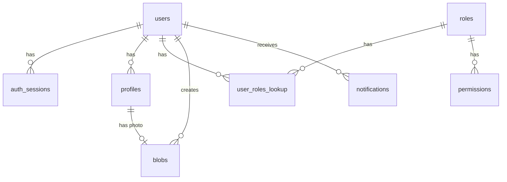

# Database Schema Documentation

## Core Tables

### schema_versions
Tracks database migrations and schema changes. This table ensures database version control and migration history.

| Column         | Type      | Description                                        |
|---------------|-----------|----------------------------------------------------|
| id            | INT       | Auto-incrementing primary key                      |
| version       | VARCHAR   | Migration version identifier (e.g., '202401010001')|
| name          | VARCHAR   | Human-readable migration name                      |
| description   | TEXT      | Detailed description of schema changes             |
| batch         | INT       | Migration batch number                             |
| installed_by  | VARCHAR   | User who ran the migration                        |
| installed_on  | TIMESTAMP | When the migration was executed                    |
| execution_time| INT       | Migration execution time in milliseconds           |
| success       | BOOLEAN   | Whether the migration completed successfully       |

### users
| Column                  | Type          | Description                                     |
|------------------------|---------------|-------------------------------------------------|
| id                     | BIGINT        | Auto-incrementing primary key                   |
| uuid                   | CHAR(12)      | Unique identifier                               |
| username               | VARCHAR(255)   | Unique username                                |
| email                  | VARCHAR(255)   | Unique email address                           |
| password               | VARCHAR(100)   | Hashed password                                |
| status                 | VARCHAR(20)    | User status (active/inactive/deleted)          |
| user_agent            | VARCHAR(512)   | User's browser agent                           |
| ip_address            | VARCHAR(40)    | User's IP address                              |
| x_forwarded_for_ip_address | VARCHAR(40) | Forwarded IP address                         |
| last_login_date       | TIMESTAMP      | Last login timestamp                           |
| created_at            | TIMESTAMP      | Record creation timestamp                      |
| expiry_time           | BIGINT        | Account expiration timestamp                    |

### roles
| Column      | Type          | Description                                     |
|-------------|---------------|-------------------------------------------------|
| id          | BIGINT        | Auto-incrementing primary key                   |
| uuid        | CHAR(12)      | Unique identifier                               |
| name        | VARCHAR(255)  | Role name                                       |
| description | TEXT          | Role description                                |
| status      | VARCHAR(20)   | Role status (active/inactive/deleted)           |
| created_at  | TIMESTAMP     | Record creation timestamp                       |

### user_roles_lookup
| Column     | Type     | Description                                     |
|------------|----------|-------------------------------------------------|
| id         | BIGINT   | Auto-incrementing primary key                   |
| user_uuid  | CHAR(12) | Reference to users.uuid                         |
| role_id    | BIGINT   | Reference to roles.id                          |

### permissions
| Column      | Type          | Description                                     |
|-------------|---------------|-------------------------------------------------|
| id          | BIGINT        | Auto-incrementing primary key                   |
| uuid        | CHAR(12)      | Unique identifier                               |
| role_id     | BIGINT        | Reference to roles.id                          |
| model       | VARCHAR(255)  | Model/resource name                             |
| permissions | VARCHAR(10)   | Permission flags                                |
| created_at  | TIMESTAMP     | Record creation timestamp                       |
| updated_at  | TIMESTAMP     | Record update timestamp                         |

### profiles
| Column      | Type          | Description                                     |
|-------------|---------------|-------------------------------------------------|
| id          | BIGINT        | Auto-incrementing primary key                   |
| uuid        | CHAR(12)      | Unique identifier                               |
| user_uuid   | CHAR(12)      | Reference to users.uuid                         |
| first_name  | VARCHAR(100)  | User's first name                              |
| last_name   | VARCHAR(100)  | User's last name                               |
| photo_uuid  | CHAR(12)      | Reference to blobs.uuid                        |
| photo_url   | VARCHAR(255)  | Direct URL to photo                            |
| status      | VARCHAR(20)   | Profile status (active/inactive/deleted)        |
| created_at  | TIMESTAMP     | Record creation timestamp                       |
| updated_at  | TIMESTAMP     | Record update timestamp                         |

### blobs
| Column      | Type          | Description                                     |
|-------------|---------------|-------------------------------------------------|
| id          | BIGINT        | Auto-incrementing primary key                   |
| uuid        | CHAR(12)      | Unique identifier                               |
| name        | VARCHAR(255)  | File name                                       |
| description | TEXT          | File description                                |
| mime_type   | VARCHAR(127)  | File MIME type                                 |
| size        | BIGINT        | File size in bytes                             |
| url         | VARCHAR(2048) | File access URL                                |
| status      | VARCHAR(20)   | File status (active/inactive/deleted)           |
| created_by  | CHAR(12)      | Reference to users.uuid                         |
| created_at  | TIMESTAMP     | Record creation timestamp                       |
| updated_at  | TIMESTAMP     | Record update timestamp                         |

### auth_sessions
| Column            | Type          | Description                                     |
|-------------------|---------------|-------------------------------------------------|
| id                | BIGINT        | Auto-incrementing primary key                   |
| uuid              | CHAR(12)      | Unique identifier                               |
| user_uuid         | CHAR(12)      | Reference to users.uuid                         |
| access_token      | VARCHAR(255)  | JWT access token                               |
| refresh_token     | VARCHAR(255)  | Refresh token                                  |
| token_fingerprint | BINARY(32)    | Hashed token fingerprint                       |
| ip_address        | VARCHAR(45)   | Client IP address                              |
| user_agent        | TEXT          | Client user agent                              |
| last_token_refresh| TIMESTAMP     | Last token refresh timestamp                    |
| access_expires_at | TIMESTAMP     | Access token expiration                         |
| refresh_expires_at| TIMESTAMP     | Refresh token expiration                        |
| status            | ENUM          | Session status (active/revoked)                |
| created_at        | TIMESTAMP     | Record creation timestamp                       |
| updated_at        | TIMESTAMP     | Record update timestamp                         |

### audit_logs
| Column      | Type          | Description                                     |
|-------------|---------------|-------------------------------------------------|
| id          | BIGINT        | Auto-incrementing primary key                   |
| uuid        | CHAR(12)      | Unique identifier                               |
| table_name  | VARCHAR(64)   | Affected table name                             |
| record_uuid | CHAR(12)      | Affected record UUID                            |
| action      | ENUM          | Action type (INSERT/UPDATE/DELETE)              |
| old_values  | JSON          | Previous record state                           |
| new_values  | JSON          | New record state                                |
| user_uuid   | CHAR(12)      | Reference to users.uuid                         |
| ip_address  | VARCHAR(45)   | Client IP address                               |
| user_agent  | TEXT          | Client user agent                               |
| created_at  | TIMESTAMP     | Record creation timestamp                       |

### notifications
| Column          | Type          | Description                                     |
|-----------------|---------------|-------------------------------------------------|
| id              | BIGINT        | Auto-incrementing primary key                   |
| uuid            | CHAR(12)      | Unique identifier                               |
| user_uuid       | CHAR(12)      | Reference to users.uuid (recipient)             |
| type            | VARCHAR(50)   | Notification type identifier                    |
| title           | VARCHAR(255)  | Notification title                              |
| content         | TEXT          | Notification content                            |
| data            | JSON          | Additional notification data                    |
| read_at         | TIMESTAMP     | When the notification was read (null if unread) |
| status          | VARCHAR(20)   | Status (delivered/read/failed)                  |
| retry_count     | INT           | Number of delivery attempts                     |
| next_retry_at   | TIMESTAMP     | Next scheduled retry timestamp                  |
| created_at      | TIMESTAMP     | Record creation timestamp                       |
| updated_at      | TIMESTAMP     | Record update timestamp                         |

## Table Relationships

## Indexing Strategy

Each table implements appropriate indexes for:
- Primary keys (automatic)
- Foreign keys
- Frequently queried fields
- UUID fields for efficient lookups
- Multi-column indexes for optimized query patterns

### Multi-Column Index Examples

#### notifications
- `idx_notifications_user_read`: (user_uuid, read_at) - Optimizes queries for unread notifications
- `idx_notifications_type_status`: (type, status) - Improves filtering by type and status
- `idx_notifications_retry`: (status, next_retry_at) - Enhances retrieval of failed notifications pending retry

#### auth_sessions
- `idx_auth_sessions_user_status`: (user_uuid, status) - Optimizes active session lookups by user
- `idx_auth_sessions_expiry`: (status, access_expires_at) - Improves expired session cleanup

### Index Naming Convention

Indexes follow a standardized naming convention for clarity and maintenance:
- `idx_[table]_[column1]_[column2]`: For multi-column indexes
- `idx_[table]_[column]`: For single-column indexes

## Audit Trail

The system maintains comprehensive audit logs through triggers on critical tables:
- Records INSERT, UPDATE, and DELETE operations
- Stores both old and new values for changes
- Captures user context (IP, user agent)
- Uses JSON format for flexible value storage