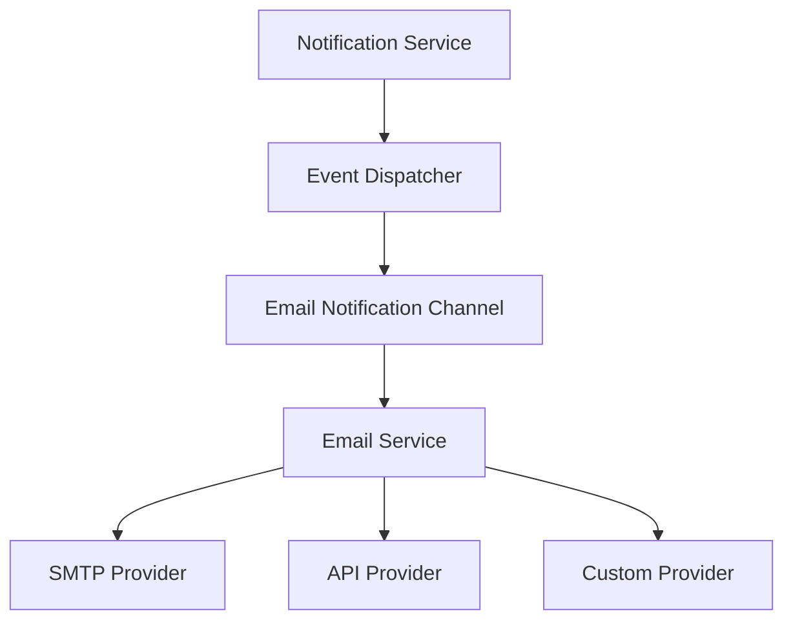

# Email Notification Extension

## Overview

The Email Notification Extension, introduced in v0.19.0, provides a comprehensive solution for sending templated email notifications through multiple delivery channels. This extension integrates with the core notification system to enable email-based communications.

## Features

- Template-based email formatting with variable substitution
- Support for multiple mail delivery providers:
  - SMTP
  - Sendgrid API
  - Mailgun API
  - Custom API providers
- HTML and plain text email support
- Attachment handling
- Email queuing and batch processing
- Delivery status tracking and retry mechanisms
- File-based caching for improved performance

## Integration with Core Notification System

The Email Notification Extension works as a delivery channel for the core notification system:



## Configuration

### Basic Configuration

Configure the extension in `config/extensions.php`:

```php
'extensions' => [
    'email_notification' => [
        'enabled' => true,
        'config' => [
            'default_provider' => 'smtp',
            'from' => [
                'address' => 'noreply@example.com',
                'name' => 'Notification System'
            ],
            'template_path' => 'storage/templates/email',
            'cache' => [
                'enabled' => true,
                'driver' => 'file', // or 'redis', 'memcached'
                'ttl' => 3600 // seconds
            ],
        ]
    ]
]
```

### Provider Configuration

Configure email providers in `config/mail.php`:

```php
return [
    'providers' => [
        'smtp' => [
            'host' => 'smtp.example.com',
            'port' => 587,
            'encryption' => 'tls',
            'username' => 'your-username',
            'password' => 'your-password',
            'timeout' => 30,
        ],
        'sendgrid' => [
            'api_key' => 'your-sendgrid-api-key',
            'endpoint' => 'https://api.sendgrid.com/v3/mail/send',
        ],
        'mailgun' => [
            'api_key' => 'your-mailgun-api-key',
            'domain' => 'mail.yourdomain.com',
            'endpoint' => 'https://api.mailgun.net/v3/',
        ],
    ],
    'default' => 'smtp',
];
```

## Usage

### Basic Usage

```php
// Get the extension instance
$emailNotification = Extensions::get('email_notification');

// Send a simple email
$emailNotification->send([
    'to' => 'recipient@example.com',
    'subject' => 'Welcome to Our Platform',
    'template' => 'welcome',
    'variables' => [
        'user_name' => 'John Doe',
        'verification_link' => 'https://example.com/verify/token123'
    ]
]);
```

### Templates

Email templates are stored in the configured `template_path` directory with `.html` and `.txt` extensions for HTML and plain text versions respectively.

Example template (`welcome.html`):

```html
<!DOCTYPE html>
<html>
<head>
    <title>Welcome to Our Platform</title>
</head>
<body>
    <h1>Welcome, {{user_name}}!</h1>
    <p>Thank you for joining our platform. Please verify your account by clicking the link below:</p>
    <p><a href="{{verification_link}}">Verify Account</a></p>
</body>
</html>
```

### Advanced Usage

```php
// Send with attachments and advanced options
$emailNotification->send([
    'to' => [
        ['email' => 'recipient1@example.com', 'name' => 'Recipient One'],
        ['email' => 'recipient2@example.com', 'name' => 'Recipient Two']
    ],
    'cc' => ['cc@example.com'],
    'bcc' => ['bcc@example.com'],
    'subject' => 'Your Invoice #123',
    'template' => 'invoice',
    'variables' => [
        'invoice_number' => '123',
        'amount' => '$99.99',
        'due_date' => '2025-05-15'
    ],
    'attachments' => [
        [
            'path' => '/path/to/invoice.pdf',
            'name' => 'Invoice-123.pdf',
            'mime' => 'application/pdf'
        ]
    ],
    'provider' => 'sendgrid', // Override default provider
    'priority' => 'high',
    'track_opens' => true,
    'track_clicks' => true
]);
```

## File Cache Driver

The extension includes a file-based cache driver for improved performance:

- Caches compiled templates to reduce disk I/O
- Stores API responses to monitor rate limits
- Implements atomic file operations for thread safety
- Provides automatic cache invalidation based on TTL

## Error Handling and Logging

The extension includes comprehensive error handling:

```php
try {
    $emailNotification->send($emailData);
} catch (EmailDeliveryException $e) {
    // Handle delivery failure
    $logger->error('Email delivery failed', [
        'error' => $e->getMessage(),
        'recipient' => $emailData['to'],
        'subject' => $emailData['subject']
    ]);
    
    // Retry logic
    if ($e->isRetryable() && $e->getAttempt() < 3) {
        $scheduler->scheduleRetry('email', $emailData, $e->getAttempt() + 1);
    }
}
```

## Extension API

| Method                        | Description                                           |
|-------------------------------|-------------------------------------------------------|
| `send(array $data)`           | Send an email using the specified template             |
| `queue(array $data)`          | Queue an email for later delivery                      |
| `sendBatch(array $emails)`    | Send multiple emails in a batch                        |
| `getTemplate($name)`          | Get a template by name                                 |
| `renderTemplate($name, $vars)`| Render a template with variables                       |
| `getDeliveryStatus($id)`      | Get the delivery status of a sent email                |