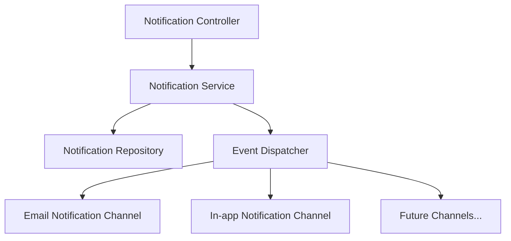

# Notification System

## Overview

The Notification System, introduced in v0.19.0, provides a comprehensive solution for managing user notifications across multiple channels. The system supports:

- In-app notifications
- Email notifications via the EmailNotification extension
- Scheduled and retry-based delivery mechanisms
- Read/unread status tracking
- JSON-based payload for flexible notification data

## Architecture

The notification system follows a modular architecture with the following components:



## Core Components

### Notification Service

The Notification Service manages the lifecycle of notifications:

```php
// Example: Sending a notification
$notificationService->send([
    'user_uuid' => $userUuid,
    'type' => 'account_verification',
    'title' => 'Verify Your Account',
    'content' => 'Please verify your account by clicking the link below.',
    'data' => ['verification_url' => $url]
]);

// Example: Retrieving unread notifications
$unreadNotifications = $notificationService->getUnreadNotifications($userUuid);

// Example: Marking a notification as read
$notificationService->markAsRead($notificationUuid);
```

### Notification Events

The system uses events to handle notification state changes:

- `NotificationCreatedEvent`: Triggered when a new notification is created
- `NotificationReadEvent`: Triggered when a notification is marked as read
- `NotificationRetryEvent`: Triggered when a failed notification is set for retry
- `NotificationScheduledEvent`: Triggered for notifications scheduled for future delivery

### Email Notification Extension

The Email Notification extension provides:

- Template-based email formatting
- SMTP and API-based delivery options
- Customizable email headers and content
- Delivery tracking and retry mechanisms

## API Endpoints

| Method | Endpoint                                 | Description                                  |
|--------|------------------------------------------|----------------------------------------------|
| GET    | /api/notifications                       | Get all notifications for authenticated user |
| GET    | /api/notifications/unread                | Get unread notifications                     |
| GET    | /api/notifications/{uuid}                | Get a specific notification                  |
| POST   | /api/notifications/mark-read/{uuid}      | Mark a notification as read                  |
| POST   | /api/notifications/mark-all-read         | Mark all notifications as read               |
| DELETE | /api/notifications/{uuid}                | Delete a notification                        |

## Configuration

Configure notification settings in `config/notifications.php`:

```php
return [
    'channels' => [
        'email' => [
            'enabled' => true,
            'driver' => 'smtp', // or 'api', 'sendgrid', etc.
            'from' => [
                'address' => 'noreply@example.com',
                'name' => 'Notification System'
            ],
            'template_path' => 'storage/templates/email',
        ],
        'database' => [
            'enabled' => true,
        ],
    ],
    'default_channel' => 'database',
    'retry' => [
        'max_attempts' => 3,
        'delay' => 300, // seconds
    ],
];
```

## Best Practices

1. **Type Naming**: Use descriptive, namespaced notification types (e.g., `user.welcome`, `order.shipped`)
2. **Payload Structure**: Keep the JSON data payload consistent for each notification type
3. **Templates**: Use reusable templates for notification content
4. **Localization**: Store user-facing content in localizable formats
5. **Cleanup**: Implement a retention policy to remove old notifications